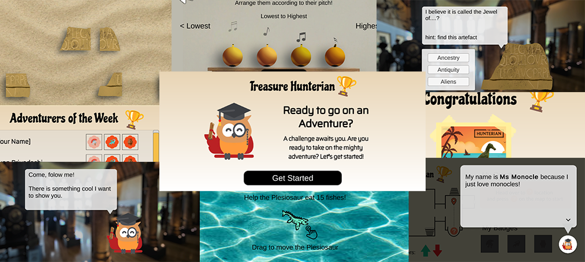

  <h2 align="center">SIT-UoG Computing Science</h2>
   
  <h3 align="center">(2022-23) OIP Team 3B presents:</h3>

   
  
  

<h3>Marvellous discoveries and adventures await you in The Hunterian Museum!</h3>

  

# About The Project

This is a design project done in collaboration with The Hunterian Museum as part of our Overseas Immersion Programme in Glasgow. The application is currently hosted on [itch.io](https://shingliya.itch.io/treasurehunterian).

 

## Problem Statement
To design a smartphone-compatible web application aimed at enriching the museum experience for children aged 11 to 14, providing interactive and meaningful encounters with artifacts to foster engagement during their visits.

 

## Built With
This project is build with [Unity3D](https://unity.com/) (verison: 2022.3.5f1) 
The output target platform is WebGL (web application) 
The application is intended to run on smartphone browsers 

 

## Folder Structure
The resources used for the project can be found in [Assets](Assets) folder. 
The sub-directories are as follows:
-   Animation - unity animation and controller files
-   Art Assets - images and textures
-   Font - text font files
-   Materials - unity material files for rendering
-   Packages - external plug-ins/add-ons (scripts, images, audio)
-   Prefabs - unity template files for creating object instances
-   Scenes - unity scene files (e.g splash screen, map screen, story screen)
-   Scripts - c# script files for controlling application logic
-   Sound - audio files

 

## Getting Started
These are the instructions for setting up the project. 
To get a local copy up and running follow these simple example steps.

### Prerequisites
You are required to have [Unity3D](https://unity.com/) installed, prefeblly verison 2022.3.5f1 or higher. 
A code editor such as [Visual Studio Code](https://code.visualstudio.com/) is recommended for editing scripts.

### Running the Project
1. Download the repo (as zip or clone).
2. Launch Unity3D.
3. From Unity3D, open the project (Add project from disk) and select the root directory of the downloaded repo.

 

## Contact

Jun Xiang - [GitHub](https://github.com/xiaopang254) - [LinkedIn](https://www.linkedin.com/in/laujunxiang/) 
Xin Jie - [GitHub](https://github.com/XJ-UoG) - [LinkedIn](https://www.linkedin.com/in/xin-jie-tan-66505b148/) 
Shyam - [GitHub](https://github.com/shyxxm) - [LinkedIn](https://www.linkedin.com/in/shyam-prasad) 
Ayan - [GitHub](https://github.com/csgnwinter) - [LinkedIn](www.linkedin.com/in/ayan-priyadarshi-52621757/) 
Ivan - [GitHub](https://github.com/shingliya) - [LinkedIn](https://www.linkedin.com/in/leongwengyanivan/) 
Jeff - [GitHub](https://github.com/miscting) - [LinkedIn](https://www.linkedin.com/in/jeffleejh/) 
